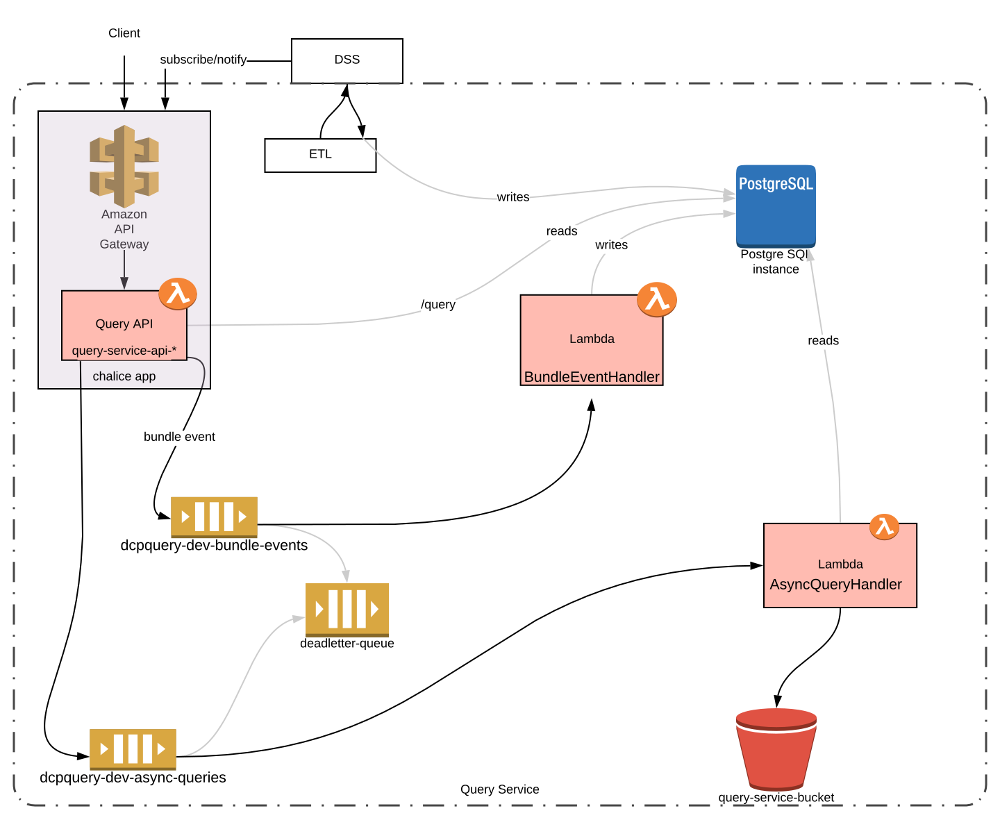

# HCA DCP Query Service

The HCA DCP Query Service provides an interface for scientists and developers to query metadata associated with
experimental and analysis data stored in the [Human Cell Atlas](https://staging.data.humancellatlas.org/)
[Data Coordination Platform](https://www.humancellatlas.org/data-sharing) (DCP). Metadata from the
[DCP Data Store](https://github.com/HumanCellAtlas/data-store) are indexed and stored in an
[AWS Aurora](https://aws.amazon.com/rds/aurora/) [PostgreSQL](https://www.postgresql.org/) database.

Queries to the database can be sent over HTTP through the Query Service API, which is available together with its
documentation at https://query.staging.data.humancellatlas.org/.

For long-running queries (runtime over 20 seconds), the Query Service supports asynchronous tracking of query results.
When a long-running query triggers this mode, the caller will receive a
[`301 Moved Permanently`](https://en.wikipedia.org/wiki/HTTP_301) response status code with a `Retry-After` header. The caller
is expected to wait the specified amount of time before checking the redirect destination, or use the query job ID
returned in the response JSON body to check the status of the query job. The caller may turn off this functionality
(and cause the API to time out and return an error when a long-running query is encountered) by setting the
`async=False` flag when calling `/query`.

For large query results, the Query Service may deposit results in S3 instead of returning them verbatim in the response
body. In this case, the client will receive a [`302 Found`](https://en.wikipedia.org/wiki/HTTP_302) response status code
sending them to the response data location. In this mode, response data are confidential to the caller, and remain
accessible for 7 days. The caller may turn off this functionality by setting the `async=False` flag when calling
`/query`.

For more user documentation, example queries, design goals, and other help, see the
[Query Service wiki](https://github.com/HumanCellAtlas/query-service/wiki).

## Query Service internal architecture


#### Query API

The REST API is a [Chalice](https://github.com/aws/chalice) app that adopts
[OpenAPI](https://github.com/OAI/OpenAPI-Specification/blob/master/versions/3.0.2.md)'s approach to specification driven
development and leverages [Connexion](https://github.com/zalando/connexion) for input parameter validation. The Chalice
app is deployed with [Amazon API Gateway](https://aws.amazon.com/api-gateway/) and
[AWS Lambda](https://aws.amazon.com/lambda/). The full API documentation can be found
[here](https://query.staging.data.humancellatlas.org).

#### Subscribing to Data Updates

The query service is subscribed to all updates to the
[DCP Data Store (DSS)](https://github.com/HumanCellAtlas/data-store). When data is added to the DSS, a webhook
containing the bundle id is sent to the Query API. The bundle_id is added to the
`dcp-query-data-input-queue-[deployment-stage]` SQS queue, which eventually calls the
`query-load-data-[deployment-stage]` lambda, which retrieves the bundle metadata and loads it into the database.

## Developing the Query Service

Most components of the Query Service are written in Python (Python version 3.6 or higher is required). After cloning
this repository, you can run the Query Service in local mode to experiment with it. In this mode, a PostgreSQL server
is expected to be running locally on the standard port (5432), and the current user is expected to have admin access to
the database referenced by `APP_NAME`.

It is recommended that you set up a dedicated Python [virtualenv](https://virtualenv.pypa.io/en/latest/) to work with
the Query Service, then install the development requirements and run the Chalice server in local mode:

```bash
mkdir venv
virtualenv --python python3.6 venv/36
source venv/36/bin/activate
pip install -r requirements-dev.txt
source environment
chalice local
```

Errors while running `source environment` can be ignored if you are just experimenting with Query Service in local mode.
After starting `chalice local`, you can open the Query Service in your browser at http://127.0.0.1:8000 to experiment
with it.

### Updating the requirements

Runtime Python dependencies for the Query Service app are listed in `requirements.txt.in`. Test/development Python
dependencies are listed in `requirements-dev.txt.in`. These files are compiled into `pip freeze` output files,
which are stored in `requirements.txt` and `requirements-dev.txt`, respectively.

To update the requirements files for the application, edit the `*.in` files and run `make refresh-all-requirements`,
then commit all the `requirements*` file changes to version control.

### Loading Test Data

To load a test dataset into the Query Service for experimenting, run `make load-test-data`. This script fetches and
loads a small (<10 MB) set of HCA production metadata.

### Deployment

The Query Service requires AWS to deploy. It uses several AWS services, including Lambda, S3, API Gateway, SQS, ACM, and
Route53. To set up the deployment, first ensure that your AWS credentials are configured by installing the
[AWS CLI](https://aws.amazon.com/cli/) and running `aws configure` or setting the
[AWS environment variables](https://docs.aws.amazon.com/cli/latest/userguide/cli-configure-envvars.html).

The Query Service uses [Terraform](https://www.terraform.io/) to manage the deployment process. Before deploying, edit
the `environment` file to set essential variables to control the deployment:

* `STAGE` - Application deployment stage (such as `dev`, `staging` or `production`)
* `APP_NAME` - The name that the query service will use to refer to itself
* `API_DOMAIN_NAME` - The domain name that the query service will register for itself using
  [Route 53](https://aws.amazon.com/route53/) and [API Gateway](https://aws.amazon.com/api-gateway/). Before continuing,
  ensure that a certificate for this domain name is available (in VERIFIED state) in the
  [AWS Certificate Manager](https://console.aws.amazon.com/acm/home). 
* `API_DNS_ZONE` - The name of a [Route 53](https://aws.amazon.com/route53/) zone that must be present in your AWS
  account, with a registered domain pointing to it. You can set up both at https://console.aws.amazon.com/route53/.

Run `source environment` to set the results of the above edits in your shell.

In the same shell, run `make install-secrets` to initialize and upload credentials that Query Service
components need to communicate with each other.

Finally, to deploy the Query Service, run `make deploy` in the same shell.

#### Minor app updates

After deploying, you can update just the Lambda function codebase by running `make update-lambda` (this is faster, but
no dependencies, routes, or IAM policies will be updated).

If you are using an AWS Assume Role profile, credentials expire in 15 minutes by default. Terraform does not integrate
with the AWS CLI, and will not automatically refresh these credentials. If your commands fail with an "ExpiredToken"
error, run `make init-tf` to refresh the credentials. To lengthen the lifetime of your Assume Role token, add a line
like `duration_seconds = 43200` in your profile in `~/.aws/config`.

#### Database management

Run `python -m dcpquery.db --help` for a list of commands available to manage the database. By default, this script
connects to the PostgreSQL database running on localhost. To connect to the remote database listed in the service
configuration, add `--db remote` to the command.

* Running `python -m dcpquery.db connect` will connect to the database using psql.

* Running `python -m dcpquery.db load` (or `make load`) will load all data from DSS. This requires substantial time and
  resources. To load a test dataset for experimenting, see "Loading Test Data".

#### Connecting directly to the database

The following command can be used 
python -m dcpquery.db connect --db remote

### Testing

Run `make test` to run unit tests. Run `make integration-test` to run integration tests, which require the Query Service
to be deployed.

### Monitoring your app

To get logs for the last 5 minutes from the app, install [Aegea](https://github.com/kislyuk/aegea) using
`pip install aegea`, then type `make get_logs` in this directory.

Lambda is automatically set up to emit logs
to [CloudWatch Logs](https://docs.aws.amazon.com/AmazonCloudWatch/latest/logs/WhatIsCloudWatchLogs.html), which you can
browse in the [AWS console](https://console.aws.amazon.com/cloudwatch/home#logs:) by selecting the log group for your
Lambda. You can see built-in CloudWatch metrics (invocations, errors, etc.) by selecting your Lambda in
the [Lambda AWS console](https://console.aws.amazon.com/lambda/home#/functions) and going to the **Monitoring** tab.  To
tail and filter logs on the command line, you can use the `logs` command in
the [Aegea](https://github.com/kislyuk/aegea) package, for example: `aegea logs /aws/lambda/dcpquery-api-dev
--start-time=-15m` (this is what `make get_logs` runs).

### Bugs & Feature Requests

Please report bugs, issues, feature requests, etc. on [GitHub](https://github.com/HumanCellAtlas/query-service/issues).
Contributions are welcome; please read [CONTRIBUTING.md](CONTRIBUTING.md).

[](https://allspark.dev.data.humancellatlas.org/HumanCellAtlas/query-service/pipelines)
[](https://codecov.io/gh/HumanCellAtlas/query-service)
[]()
[](https://allspark.dev.data.humancellatlas.org/HumanCellAtlas/query-service/commits/master)
