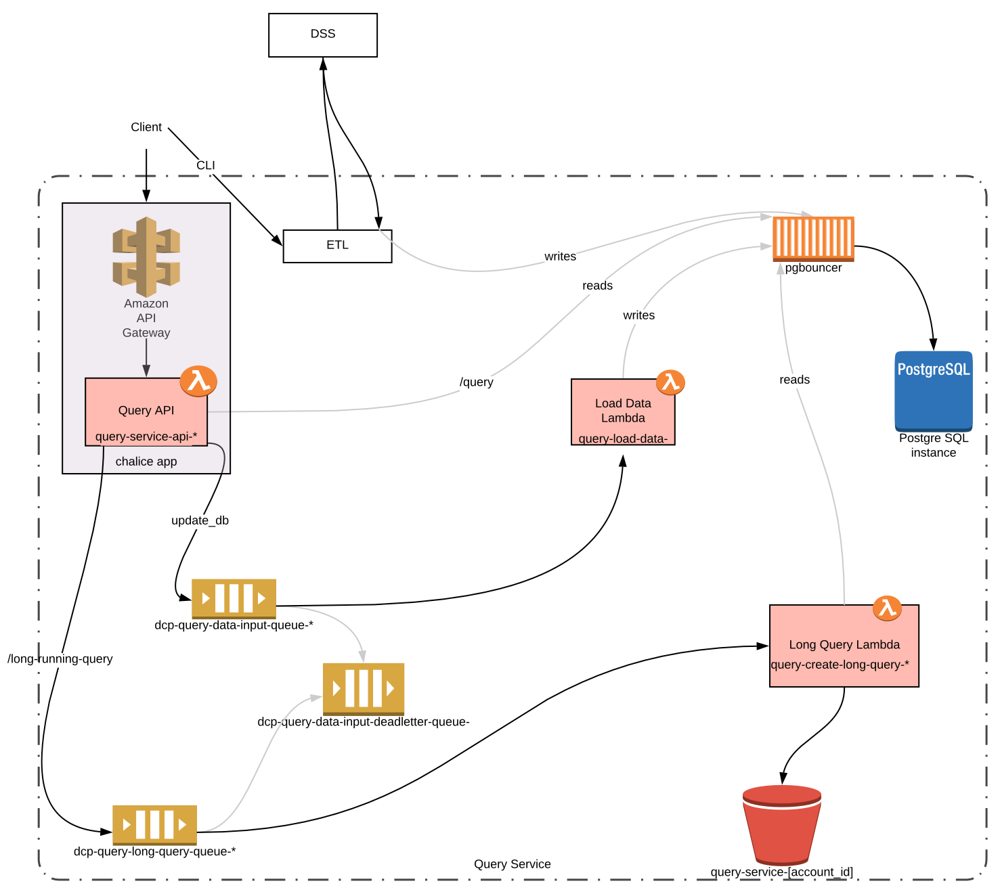

# Query Service
[](https://allspark.dev.data.humancellatlas.org/HumanCellAtlas/query-service/pipelines)

Placeholder for the Metadata Query Service


# Query Service
[](https://codecov.io/gh/HumanCellAtlas/query-service)

######TODO add these links
[](URL to service)
[](https://allspark.dev.data.humancellatlas.org/HumanCellAtlas/query-service/pipelines)

## Overview

The Query Service (QS) provides an interface for scientists and developers to query metadata associated with gene 
expression data stored in the [Human Cell Atlas](https://staging.data.humancellatlas.org/) [Data Coordination
Platform](https://www.humancellatlas.org/data-sharing) (DCP). Metadata from the
[DCP Data Store](https://github.com/HumanCellAtlas/data-store) are indexed and stored in an [AWS Aurora PostgreSQL](add_url) 
database, query requests are  processed by [AWS Lambda](https://aws.amazon.com/lambda/)
queries submitted through the `/query` endpoint directly return the data while the results of longer running queries 
(`/long-running-query`) are stored in a [Amazon S3](https://aws.amazon.com/s3/) bucket. The service exposes a 
[REST API](https://query.staging.data.humancellatlas.org) for querying and retrieving
data.   
### Components

[LucidChart Architecture Diagram](https://www.lucidchart.com/invitations/accept/02e38662-6da1-48ad-87ac-0355bb3a03d8)



#### Query API

The REST API is a [Chalice](https://github.com/aws/chalice) app that adopts [Swagger/OpenAPI](https://swagger.io/)'s
approach to specification driven development and leverages [Connexion](https://github.com/zalando/connexion) for
input parameter validation. The Chalice app is deployed with [Amazon API Gateway](https://aws.amazon.com/api-gateway/)
and [AWS Lambda](https://aws.amazon.com/lambda/). The full API documentation can be found
[here](https://query.staging.data.humancellatlas.org).


#### Load Data

The query service is subscribed to all updates to the [DCP Data Store (DSS)](https://github.com/HumanCellAtlas/data-store). 
When data is added to the DSS a webhook containing the bundle id is sent to the Query API. The bundle_id is added to the
  `dcp-query-data-input-queue-*` which eventually calls the `query-load-data-*` lambda which calls an extract transform 
 load (ETL) function, retrieving the bundle data and loading it into the postgres db.

#### Query
Queries sent to the `/query/async` endpoint are added to the `dcp-query-async-query-queue-*` along with a unique 
id (which is also returned to the user). Events in the queue call the `query-create-async-query-*` lambda to run the 
query and eventually load the results into the `query-service-[account_id]` [Amazon S3](https://aws.amazon.com/s3/) 
bucket. Users can use the returned unique id to to retrieve the job status and (eventually) a link to the result via 
`/query/async/{job_id}` . Fast queries sent to the `/query` endpoint are resolved in the chalice app and the results 
are returned directly.


## Getting Started

### Requirements
- Python >= 3.6
- Terraform == 0.11.10
### Environment Setup
- Clone the `query-service` repo
- Create virtualenv and install dependencies
```bash
mkdir venv
virtualenv --python python3.6 venv/36
source venv/36/bin/activate
pip install -r requirements.txt
```
### Deployment
- Set DEPLOYMENT_STAGE and AWS_PROFILE
- Run the following commands from the root directory
```bash
source environment
make secrets -C terraform/
make init -C terraform/
make plan -C terraform/
make apply -C terraform/
make deploy -C query/
```

### Testing
```bash
make install tests -C query/
```

### Debugging/Troubleshooting

