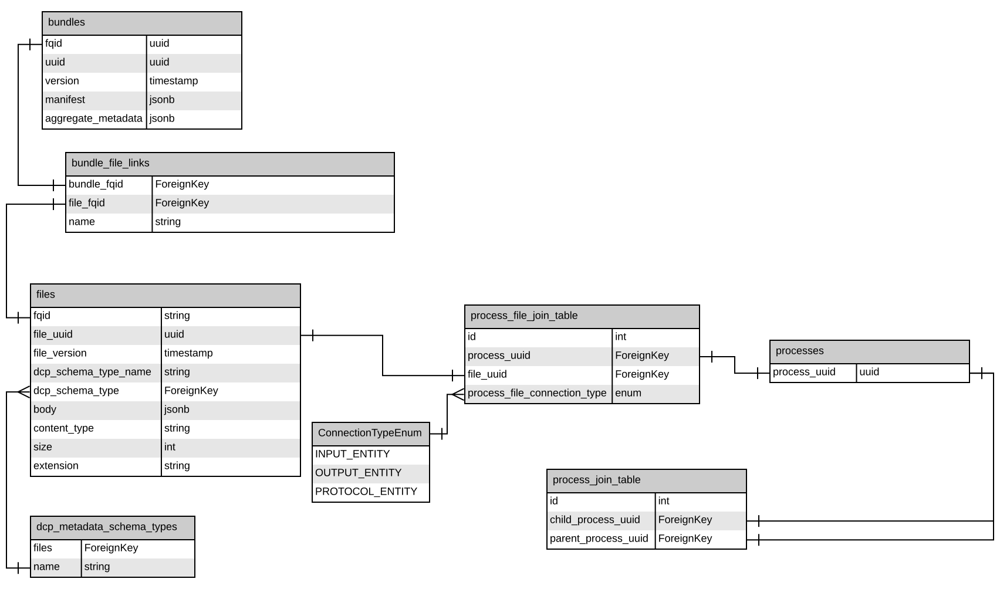

HCA DCP Query Service
=====================

# Introduction

The HCA DCP Query Service provides an interface for scientists and developers to query metadata associated with
experimental and analysis data stored in the [Human Cell Atlas](https://staging.data.humancellatlas.org/)
[Data Coordination Platform](https://www.humancellatlas.org/data-sharing) (DCP). Metadata from the
[DCP Data Store](https://github.com/HumanCellAtlas/data-store) are indexed and stored in an
[AWS Aurora](https://aws.amazon.com/rds/aurora/) [PostgreSQL](https://www.postgresql.org/) database.

# Query via the API
Queries to the database can be sent over HTTP through the Query Service API
[Swagger Documentation](https://query.data.humancellatlas.org/v1/ui/#/)
or via the [Query Builder](https://query.data.humancellatlas.org/)

## Executing Queries
To execute a query via the swagger interface 
- Click on the green `/query` row to expand it
- Click `Try it out`
- Edit the request body by adding in your query and any parameters. 

For example
```
{
  "params": {"s": 0},
  "query": "select * from files where size > %(s)s limit 10"
}
```
- click `Execute`
## Async Queries
For long-running queries (runtime over 20 seconds), the Query Service supports asynchronous tracking of query results.
When a long-running query triggers this mode, the caller will receive a
[`301 Moved Permanently`](https://en.wikipedia.org/wiki/HTTP_301) response status code with a `Retry-After` header. The caller
is expected to wait the specified amount of time before checking the redirect destination, or use the query job ID
returned in the response JSON body to check the status of the query job. The caller may turn off this functionality
(and cause the API to time out and return an error when a long-running query is encountered) by setting the
`async=False` flag when calling `/query`.

For large query results, the Query Service may deposit results in S3 instead of returning them verbatim in the response
body. In this case, the client will receive a [`302 Found`](https://en.wikipedia.org/wiki/HTTP_302) response status code
sending them to the response data location. In this mode, response data are confidential to the caller, and remain
accessible for 7 days. The caller may turn off this functionality by setting the `async=False` flag when calling
`/query`.

# Data Schema


Because there are often multiple, slightly different versions of a bundle or file, `bundles_all_versions` and 
`files_all_versions` contain all versions of the bundles and files. There are also derived view tables `files` and `bundles`
which only contain the latest version of each bundle or file. 

The metadata itself is available in `files.body` as a jsonb data object. The structure of that document is dependent on the `dcp_schema_type`. The schemas for each schema type can be found [here](https://schema.humancellatlas.org/a). 
Its also possible to pull the full jsonb for a file of a particular schema type and explore it in your text editor to better understand what data it contains and how it is formatted.
For example to get the jsonb associated with a cell line
```postgresql
SELECT body FROM files WHERE dcp_schema_type='cell_line';
``` 
or
```postgresql
SELECT body FROM cell_line;
```
To simplify queries, the view tables for each schema type contain only the most recent version of each metadata file as the schema of the metadata may change between versions 

Possible schema_types include 
`cell_line`,
`cell_suspension`,
`differentiation_protocol`,
`dissociation_protocol`,
`donor_organism`,
`ipsc_induction_protocol`,
`library_preparation_protocol`,
`links`,
`organoid`,
`process`,
`project`,
`sequence_file`,
`sequencing_protocol`,
`specimen_from_organism`,
`supplementary_file`,
`analysis_file`,
`analysis_process`,
`analysis_protocol`,
`collection_protocol`,
`enrichment_protocol`,
`biomaterial`,
`file`,
`image_file`,
`imaged_specimen`,
`imaging_preparation_protocol`,
`imaging_protocol`


# Example Queries
Get a list of all of the tables
```postgresql
SELECT table_name
FROM information_schema.tables
WHERE table_type = 'BASE TABLE'
 AND table_schema NOT IN ('pg_catalog', 'information_schema')
 AND table_schema = 'public';
```
Get total number of bundles
```postgresql
SELECT count(*) from bundles;
```
Get all data for 10 bundles
```postgresql
SELECT * FROM bundles LIMIT 10;
```
Select the data for a particular bundle
if you use the uuid this may return multiple versions of the bundle, to only get one use the fqid (which is the version concatenated to the uuid)
```postgresql
SELECT * FROM bundles WHERE uuid='000f989a-bea2-46cb-9ec1-b4de8c292931'
```
## Querying the metadata body
The metadata itself is stored in the jsonb format, for help with the syntax of querying jsonb check out this [cheat sheet](https://hackernoon.com/how-to-query-jsonb-beginner-sheet-cheat-4da3aa5082a3).

Get a list of submissions for a particular submitter
```postgresql
SELECT p.uuid, p.body->'project_core'->>'project_title' AS title
FROM project AS p
WHERE p.body @> '{"contributors": [{"contact_name": "Aviv,,Regev"}]}'
   OR p.body @> '{"contributors": [{"contact_name": "Sarah,,Teichmann"}]}';
```

## Querying the experimental graph
If you have a fastq file and you are curious about its inputs you can use a custom sql function `get_all_parents` to get all of the processes that led to its creation. For example:

If your sequence file has a uuid of `0b978294-b297-4a2f-bc2a-b5b67ab1f71e` you can run 
```postgresql
SELECT * FROM process_file_join_table 
WHERE file_uuid = '0b978294-b297-4a2f-bc2a-b5b67ab1f71e';
```
This should return a list of all the processes the file is associated with. Find a row that says `OUTPUT_ENTITY` and copy the `process_uuid`

Then run the following to get a list of all of its parent processes
```postgresql
SELECT * FROM  get_all_parents('f7755994-8ba5-4d79-b9fb-7274f0dbfc52')
```
- Direct parents are processes whose output becomes the input for the current process
- `get_all_parents` grabs the processes whose output was the input for the current process and then gets the processes whose output was the input for the parent process and then goes all the way up to the initial file (typically a `donor_organism` file)
- You can also use the `get_all_children` function to go the opposite way
- This allows us to represent graphical data in a relational database

`donor_organism` files are typically at the top of the graph. If you have a `file_uuid` for a `donor_organism` and you'd like to get all of the `sequence_files` that came from that donor you can run the following substituting in the `file_uuid` of your `donor_organism`.
```postgresql
SELECT *
FROM (SELECT file_uuid
      FROM process_file_join_table
      WHERE process_uuid IN (SELECT get_all_children(process_uuid)
                             FROM process_file_join_table
                             WHERE file_uuid = 'c9e7f3d4-c2ce-4e88-ac86-339847d33a6b')) AS temp_table
       JOIN files ON temp_table.file_uuid = files.uuid
WHERE files.dcp_schema_type_name = 'sequence_file';
```
Further notes on the above query:

- To get all file types, leave off the final `WHERE` clause
- To retrieve files higher in the graph, replace `get_all_children` with `get_all_parents` 

If you are trying to get all of the files in a graph, it is necessary to specifically retrieve:
- Any input files and protocol files for a process when running `get_all_children` 
- Any  output files and protocol files for a process when running `get_all_parents`
